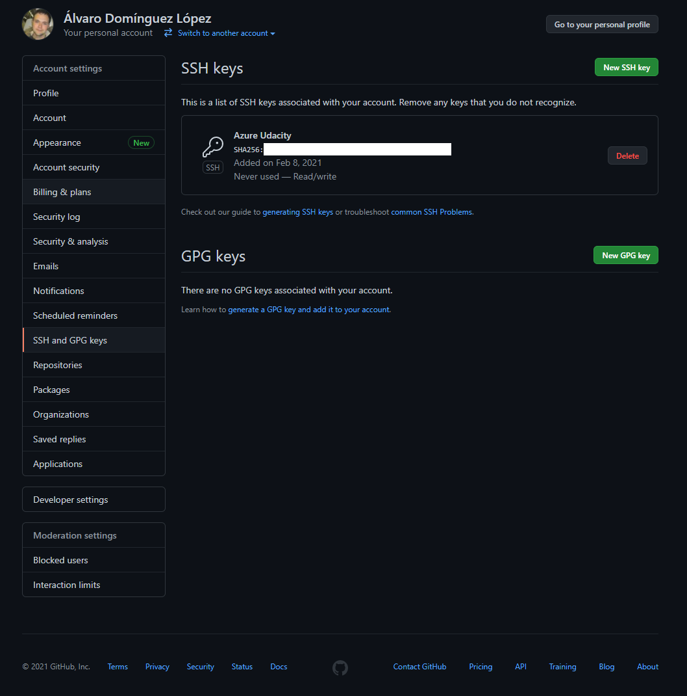

# Udacity Azure Agile Development

[](https://github.com/alvarodl/UdacityAzureAgileDevelopment/actions/workflows/pythonapp.yml)

## Overview

In this project, I will build a Github repository from scratch and create a scaffolding that will assist me in performing both Continuous Integration and Continuous Delivery. I'll use Github Actions along with a Makefile, requirements.txt and application code to perform an initial lint, test, and install cycle. Next, I'll integrate this project with Azure Pipelines to enable Continuous Delivery to Azure App Service.

This project will give me an opportunity to demonstrate my ability to perform continuous delivery for a Python-based machine learning application using the Flask web framework. I will apply the skills I have acquired in this course to operationalize a Machine Learning Microservice API.

## Scenario

You are given a pre-trained, sklearn model that has been trained to predict housing prices in Boston according to several features, such as average rooms in a home and data about highway access, teacher-to-pupil ratios, and so on. If you're curious, you can read more about the data, which was initially taken from Kaggle, on the [data source site](https://www.kaggle.com/c/boston-housing). This project tests your ability to operationalize a Python flask app—in a provided file, [app.py](./app.py)—that serves out predictions (inference) about housing prices through API calls. This project could be extended to any pre-trained machine learning model, such as those for image recognition and data labeling.

## Project Plan

* Trello board for the project is available [here](https://trello.com/b/FO0Mk8xv/azure-devops-flask-ml).
* Project plan spreadsheet is placed [here](./documents/Planning.xlsx).

## Instructions


### CI with GitHub Actions

The file **pythonapp.yml** in **.github** directory contains the steps of the workflow executed every time a commit is pushed to the repository.

So, every time changes are pushed to GitHub the workflow defined in that file is going to be executed:


### Set up Azure Cloud Shell

Go to Azure Portal and open Azure Cloud Shell clicking in the highlighted button in the next image:


Generate SSH keys with the command:

``` ssh-keygen -t rsa ```

Copy the generated public key and add it to GitHub. In GitHub go to **Settings > SSH and GPG Keys > Add SSH Key** and paste your key.



Now, in Azure Cloud Shell clone the repository with the command:

```git clone git@github.com:alvarodl/UdacityAzureAgileDevelopment.git```


Run the **All** command of the **Makefile** to install dependencies, lint and test code with the command:

```make all```


### Azure App Service

Application can be deployed to an Azure App Service following the next steps:

- Enable Python Virtual Environment with the command:

    ```python3 -m venv ~/.UdacityAzureAgileDevelopment```

- Then activate the virtual environment:

```source ~/.UdacityAzureAgileDevelopment/bin/activate```

- Run the command **Install** command of the **Makefile** to install dependencies:

```make install```

- Create the webapp using Azure CLI:

```az webapp up -n udacity-flask-ml-project```


### Azure Pipelines

To enable CI with Azure Pipelines go to your organization in Azure DevOps and create a new project. In the project settings create a new **Service connection**  of type **Azure Resource Manager** to the Azure App Service created previously.


Then, create a new pipeline selecting GitHub as origin of the source code.


When the pipeline is executed the result is similar to this:


### Executing the app

To perform a prediction the script **make_predict_azure_app.sh** can be executed. The result of the execution must be:


### Streamed Log Files


## Enhancements

- Create a frontend to the API.
- Add Load Testing.
- Add Code Coverage and Quality Gates steps to CI.

## Demo

<TODO: Add link Screencast on YouTube>


